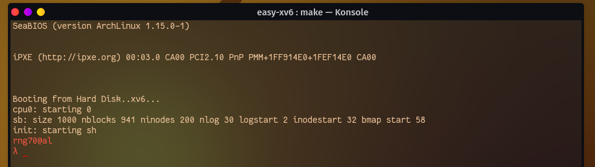

# xv6

---

This is modified version of official xv6-public version. Most of the modifcation credit goes to [Tanin](https://github.com/rng70) and [Afnan](https://github.com/AfnanCSE98).


*   easy functionality
    *   [adding system calls easily](#modularize-syscalls)
*   [bug fixes](#bug-fix)
    *   make qemu "error: writing 1 byte into a region of size 0”
    *   qemu hangs on "Booting from hard disk..."

# Installation 

---

This version is slightly modified and tested on

*   OS: Fedora Workstation 35
*   Kernel: 5.15.12-200.fc35.x86_64
*   Shell: zsh 5.8
*   gcc/g++: gcc version 11.2.1 20211203 (Red Hat 11.2.1-7) (GCC) 


# Bug-Fix

1.   ***Case 1: make qemu "error: writing 1 byte into a region of size 0"***

​	two lines added before and after **line 1461: *lastaddr = 99; in usertests.c**

```c
#pragma GCC diagnostic ignored "-Wstringop-overflow"
*lastaddr = 99;
#pragma GCC diagnostic pop
```


2.   ***Case 2: qemu hangs on "Booting from hard disk..."***

​	this problem occurs specially on arch linux though it is quite common for other distros also. See [#155](https://github.com/mit-pdos/xv6-public/pull/155). to solve this problem Makefile was slightly modified.

# Explore xv6 

---

##### Modularize SysCalls

system calls was modularized from here [#162](https://github.com/mit-pdos/xv6-public/pull/162)

adding a system call is not easy as it is needed to be added to 5 different files

*   in **Makefile** _(two places)_
*   in **syscall.h**
*   in **syscall.c** _(two places)_
*   in **usys.S**
*   in **user.h**

in this version of xv6 adding system call is little bit easy. just need to add two line of code in `syscall.h` and `systemcallnames.h`


##### Modify userlevel indicator

Lets say we want to replace the `$` sign with username of the system which can be achieved by editing  `sh.c` file. 

To achieve required result change source code inside `getcmd` method.

first of all, add these two line of code at the beginning of `sh.c`

```c
#define ANSI_COLOR_RESET  "\x1b[0m"
#define ANSI_COLOR_RED  "\x1b[31m"
```

ANSI_COLOR_CODE list:

```c
#define ANSI_COLOR_BLACK   "\x1b[30m"
#define ANSI_COLOR_RED     "\x1b[31m"
#define ANSI_COLOR_GREEN   "\x1b[32m"
#define ANSI_COLOR_YELLOW  "\x1b[33m"
#define ANSI_COLOR_BLUE    "\x1b[34m"
#define ANSI_COLOR_MAGENTA "\x1b[35m"
#define ANSI_COLOR_CYAN    "\x1b[36m"
#define ANSI_COLOR_WHITE   "\x1b[37m"
#define ANSI_COLOR_DEFAULT "\x1b[39m"
#define ANSI_COLOR_RESET   "\x1b[0m"
```

now editing `getcmd` method in `sh.c` like the following

```c
printf(2, ANSI_COLOR_RED "rng70@al\nλ " ANSI_COLOR_RESET);
```

now open terminal and run `make qemu` and see the userlevel indicator changed




## official statement [here](./README)
